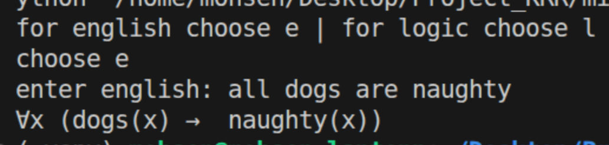
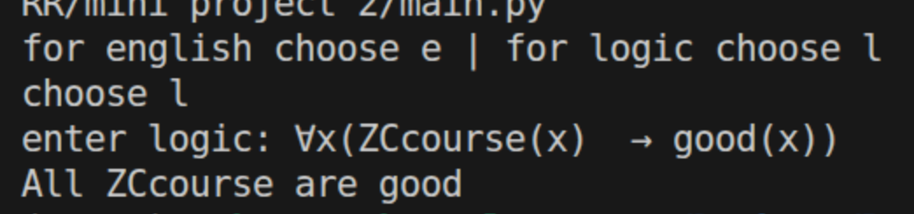

# KRR Project

## Mini project 1

**Truth table**

| a     | b     | c     | d     | e     | f     | door is opened |
| ----- | ----- | ----- | ----- | ----- | ----- | -------------- |
| True  | True  | True  | True  | True  | True  | False          |
| True  | True  | True  | True  | True  | False | False          |
| True  | True  | True  | True  | False | True  | False          |
| True  | True  | True  | True  | False | False | False          |
| True  | True  | True  | False | True  | True  | False          |
| True  | True  | True  | False | True  | False | False          |
| True  | True  | True  | False | False | True  | False          |
| True  | True  | True  | False | False | False | False          |
| True  | True  | False | True  | True  | True  | False          |
| True  | True  | False | True  | True  | False | False          |
| True  | True  | False | True  | False | True  | False          |
| True  | True  | False | True  | False | False | False          |
| True  | True  | False | False | True  | True  | False          |
| True  | True  | False | False | True  | False | False          |
| True  | True  | False | False | False | True  | False          |
| True  | True  | False | False | False | False | False          |
| True  | False | True  | True  | True  | True  | False          |
| True  | False | True  | True  | True  | False | False          |
| True  | False | True  | True  | False | True  | False          |
| True  | False | True  | True  | False | False | False          |
| True  | False | True  | False | True  | True  | False          |
| True  | False | True  | False | True  | False | True           |
| True  | False | True  | False | False | True  | False          |
| True  | False | True  | False | False | False | False          |
| True  | False | False | True  | True  | True  | False          |
| True  | False | False | True  | True  | False | False          |
| True  | False | False | True  | False | True  | False          |
| True  | False | False | True  | False | False | False          |
| True  | False | False | False | True  | True  | False          |
| True  | False | False | False | True  | False | False          |
| True  | False | False | False | False | True  | False          |
| True  | False | False | False | False | False | False          |
| False | True  | True  | True  | True  | True  | False          |
| False | True  | True  | True  | True  | False | False          |
| False | True  | True  | True  | False | True  | False          |
| False | True  | True  | True  | False | False | False          |
| False | True  | True  | False | True  | True  | False          |
| False | True  | True  | False | True  | False | False          |
| False | True  | True  | False | False | True  | False          |
| False | True  | True  | False | False | False | False          |
| False | True  | False | True  | True  | True  | False          |
| False | True  | False | True  | True  | False | False          |
| False | True  | False | True  | False | True  | False          |
| False | True  | False | True  | False | False | False          |
| False | True  | False | False | True  | True  | False          |
| False | True  | False | False | True  | False | False          |
| False | True  | False | False | False | True  | False          |
| False | True  | False | False | False | False | False          |
| False | False | True  | True  | True  | True  | False          |
| False | False | True  | True  | True  | False | False          |
| False | False | True  | True  | False | True  | False          |
| False | False | True  | True  | False | False | False          |
| False | False | True  | False | True  | True  | False          |
| False | False | True  | False | True  | False | False          |
| False | False | True  | False | False | True  | False          |
| False | False | True  | False | False | False | False          |
| False | False | False | True  | True  | True  | False          |
| False | False | False | True  | True  | False | False          |
| False | False | False | True  | False | True  | False          |
| False | False | False | True  | False | False | False          |
| False | False | False | False | True  | True  | False          |
| False | False | False | False | True  | False | False          |
| False | False | False | False | False | True  | False          |
| False | False | False | False | False | False | False          |

**the unique solution:**
traveler a and c and e are telling the truth on the other hand b and d and f are lying

**propositional logic**

| travler | logical statement                                              |
| ------- | -------------------------------------------------------------- |
| a       | ¬ b                                                            |
| b       | c ^ d                                                        |
| c       |¬ av ¬ b                                                     |
| d       | (a ^ b)v ( a ^ ¬ b)                                 |
| e       | ((a ^ b)v (a ^ c)v (a ^ d)v (a ^ e)v (a ^ f)v (b ^ c)v (b ^ d)v (b ^ e)v (b ^ f)v (c ^ d)v (c ^ e)v (c ^ f)v (d ^ e)v (d ^ f)v (e ^ f))
| f       | d ^ ¬ e

## Mini project 2

This project allows the user to convert between predicate logic statements and normal everyday English. It does this by utilising an interesting combination of direct string replacement for simple scenarios and Reguler expressions (RegEx), as implemented by the standard re library, for more complicated scenarios involving convoluted patterns such as impliction `if x then y`. Direct string replacement is done through tthe aid of a dictionay.

**translating to logic**

**translating to english**

